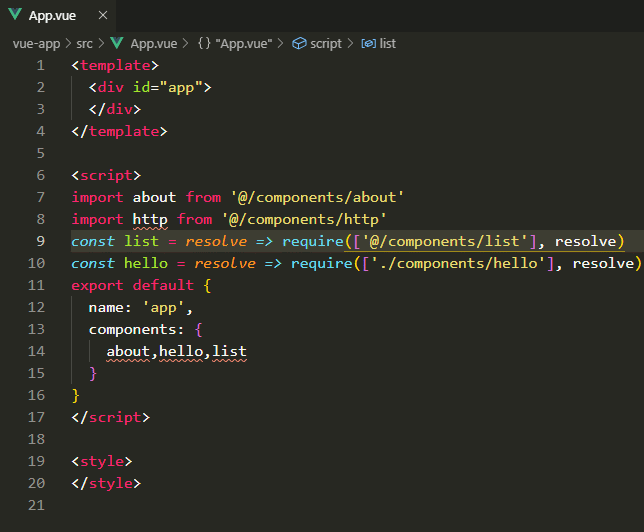

# smart-jump

> 支持别名路径、省略文件后缀名的智能跳转 VSCode 插件，支持任何项目，可以自由配置各种类型的映射规则，自由配置可缺省后缀名列表, 也支持省略默认的 index 入口文件，支持 Windows、macOS、Linux 等任意平台

## 使用方法

鼠标移动到路径上，按住`ctrl`（MAC 电脑默认是 `command`）并单击就会跳转

## 配置项

> 配置项可以写入`settings.json`中，来扩展插件的能力

如果写入配置后不生效，试试重启 vscode

- 路径映射，`/`表示项目根目录，支持 js、css、ts、vue 等任意文件，示例如下：

```json
    "smart-jump.mappings": {
        "~@": "/src", // webpack支持的css中别名引用路径
        "/@": "/src", // "/@"映射到"/src"
        "@":"/src"  // 默认只有`@`映射，映射到`/src`，你可以添加更多映射，映射路径必须以`/`开头
        // ...更多映射关系
    }
```

- 可缺省后缀名的文件列表，以下文件不需要写后缀名

```json
    "smart-jump.allowedsuffix": ["js","vue","jsx","ts"]  // 默认有这四项
```

- 判断项目根目录的依据，默认为 package.json，即存在该文件的目录为项目根目录，例如小程序项目可以改成 app.json

```json
    "smart-jump.rootpath": "package.json"
```

## 效果图


